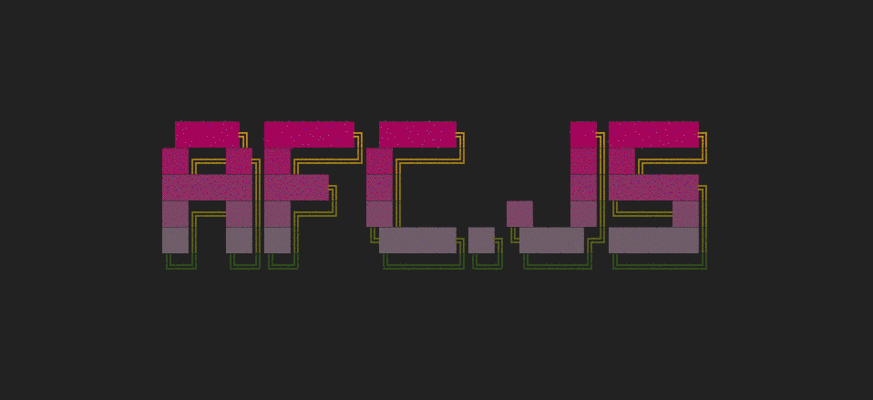
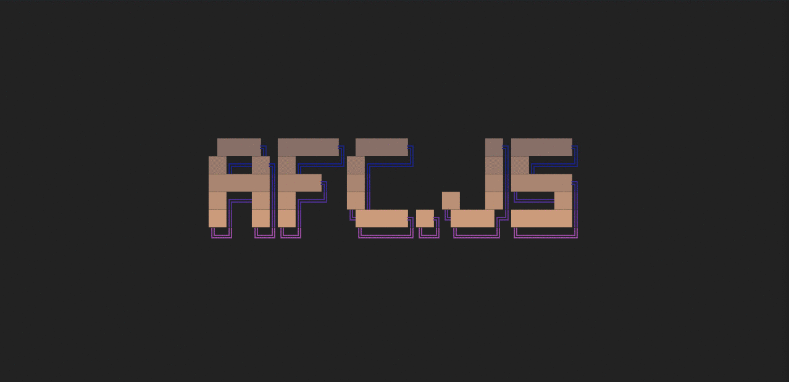
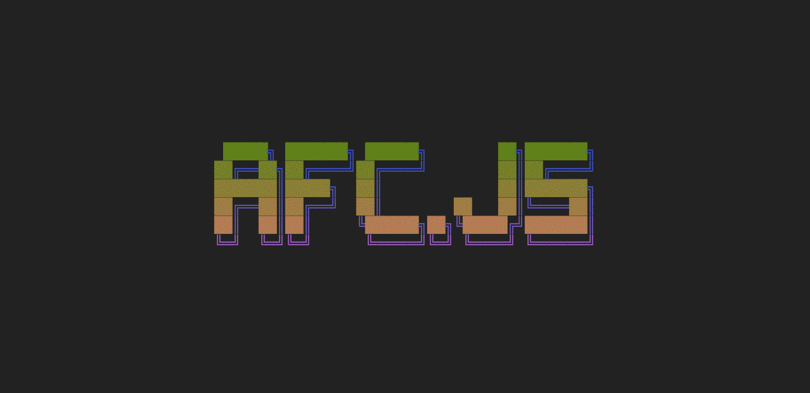

# afc.js
afc.js - ASCII Font Colorizer in Vanilla JavaScript:



## Overview
afc.js is a script that colorizes ASCII Art. The script works in two steps:
1. It searches the Text for specific characters and puts the associating characters in a 'span' element with the .ascii# (# is a number) class.
2. It gets all the elements with the classes from step 1 and adds the inline-css-color. If specified it will also repeat this step with random colors and also animate the change via CSS Transitions.

## Configuration
I think it's obvious that you need to load the script in your HTML file:
```
<script src="path/to/afc.js"></script>
```
### CSS Requirements
You need to make sure the 'pre' elements have no margin (per browser-default they have). If you use a CSS reset, this should already be taken care of. Otherwise you can use the 'ascii.css' file in the 'css' folder, or just add these lines to your css file:
```
.ascii pre {
  margin: 0
}
```

### HTML Minimum Config
In order to work the script needs an container element with the '.ascii' class, containing the 'pre' elements with the ASCII Art.
This .ascii element needs to have one attribute called 'ascii_characters' with the characters the script should colorize as an argument:
```
<div class="ascii" ascii_characters="█▌▄▀,═║╔╗╝╚">
  <pre> █████╗ ███████╗ ██████╗        ██╗███████╗</pre>
  <pre>██╔══██╗██╔════╝██╔════╝        ██║██╔════╝</pre>
  <pre>███████║█████╗  ██║             ██║███████╗</pre>
  <pre>██╔══██║██╔══╝  ██║        ██   ██║╚════██║</pre>
  <pre>██║  ██║██║     ╚██████╗██╗╚█████╔╝███████║</pre>
  <pre>╚═╝  ╚═╝╚═╝      ╚═════╝╚═╝ ╚════╝ ╚══════╝</pre>
</div>
```
The different character-sets should be separated by a comma ',' and the characters should not be separated by spaces, just like the example above.
Per default the script will generate a random RGB color for you, everytime you reload/revisit the page.

### Specific colors
Needs to be implemented first...

### Interval
When you add the attribute 'ascii_interval' to the '.ascii' element and forget to add a value like this:

```
<div class="ascii" ascii_characters="█▌▄▀,═║╔╗╝╚" ascii_interval>
```
or this:
```
<div class="ascii" ascii_characters="█▌▄▀,═║╔╗╝╚" ascii_interval="">
```
... then you have a strobo-party!


And if you add a value like '1' (for 1 second) you got something like this:

```
<div class="ascii" ascii_characters="█▌▄▀,═║╔╗╝╚" ascii_interval="1">
```


Values with decimal places are also possible:
```
<div class="ascii" ascii_characters="█▌▄▀,═║╔╗╝╚" ascii_interval="0.1">
```

## Todo
- [ ] hsl color support (not working right now).
- [ ] Make it possible to define the start and end colors for each character-sets.
- [x] Cleanup the configuration options.
- [x] Create a way to specify the characters once, and add the start and end colors later (reapiting).
- [x] Write examples with images (in the README).
- [ ] maybe add stuff like different modes like color-circles, waves...
- [ ] Fix the letter-spacing/monotype Mobile browser issue.

## Where do I get ASCII fonts?
Different ASCII Fonts can be found here:
- [Patorjk's Text to ASCII Art Generator](http://www.patorjk.com/software/taag/#p=testall&f=Alpha&t=AFC.JS)
- [FIGlet](http://www.figlet.org/)
- Or any other ASCII Art resource ;-)
